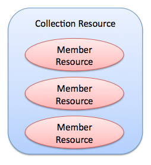
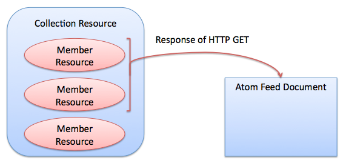
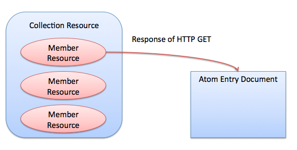
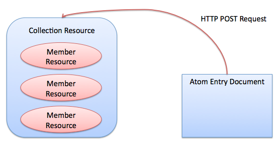
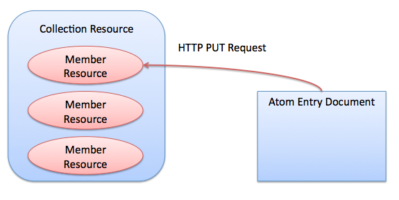
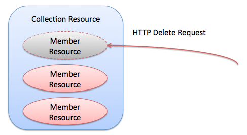

========================
OpenPNE Web API Overview
========================

Overview
========

OpenPNE Web API is realized getting, creating, updating and deleting a resource by exchanging two types of Atom Documents (Atom Feed Document and Atom Entry Document) that are defined in RFC 4287 (http://tools.ietf.org/rfc/rfc4287.txt), with client and server.

Usable resource in OpenPNE Web API are Member Resource and Collection Resource. Member Resource presents indivisibility accessing target, that is described by Atom Entry Document. Collection Resource presents collection of accessing targets, that is described by Atom Feed Document.

Member Resource and Collection Resource have own URI. URI that is related with Member Resource, is called as Member URI. URI that is related with Collection Resource, is called as Collection URI. You can handle request by accessing these URIs with request parameter and request method.

For example, you can get Collection Resource by doing GET to Collection URI. You know a Member URI of specified Member Resource, and you can get Member Resource by doing GET to Resource URI. You change the obtained Atom Entry Document that is described the Member Resource, and you can update the Member Resource by doing PUT the changed document. You write a new Atom Entry Document by referring the obtained Atom Entry Document, and you create a new Member Resource in the Collection Resource by doing POST to Collection URI. And you can delete useless Member Resource by doing DELETE to the Member URI.

Usable Features in OpenPNE Web API
==================================

Every APIs are provided whichever in the following features.

 * Getting Entries
     * Full-text Searching
     * Filtering by category
     * Searching by author
     * Specifying an index of first result and maximum number of results
     * Sorting
 * Get an Entry
 * Create an Entry
 * Update an Entry
 * Delete an Entry

URI for using OpenPNE Web API
=============================

You can access to OpenPNE Web API is from api application in OpenPNE3.

If the SNS has an api.php front controller script that is for using accessing api application (that is default of OpenPNE3), URI Formatting like the following:

Normal Collection URI:
  http://example.com/api.php/feeds/{kind of resource}

Collection URI that has parent Resource:
  http://example.com/api.php/feeds/{kind of resouce}/{kind of parent resource}/{parent resource ID}

Member URI:
  http://example.com/api.php/feeds/{kind of resource}/{resouce ID}

In this page, descriptions use the following URIs to explain way to use API.

Collection URI
    http://example.com/api.php/feeds/example

Member URI
    http://example.com/api.php/feeds/example/1

Atom Entry Document that is sent from Client
============================================

Every API top page contains an explaining for describing the resource by Atom Entry Document.

A "(optional)" element is not mandatory element for POST and PUT. And, these elements are not editable. If you contain these elements in a request, these are ignored.

Get Entries
===========

You can obtain entries by doing GET to Collection URI.

And that result is sorted or filtered by request parameters.

.. _search-query:

Full-text Searching
-------------------

You can do a full-text search by using "q" query.

::

  GET /api.php/feeds/example?q=term HTTP/1.1
  Host: example.com

The search is case-insensitive.

::

  GET /api.php/feeds/example?q=term1%20term2 HTTP/1.1
  Host: example.com

%20 is URL-encoded space ( ). The above request obtains entries that have "term1" and "term2" (AND search).

::

  GET /api.php/feeds/example?q=%22exact%20phrase%22 HTTP/1.1
  Host: example.com

%22 is URL-encoded double-quotation ("). The above request obtains entries that have "exact phrase" phrase.

::

  GET /api.php/feeds/example?q=-term HTTP/1.1
  Host: example.com

The above request obtains entries that don't have "term" word.

These queries are compositable.

::

  GET /api.php/feeds/example?q=%22exact%20term%22%20term1%20-term2%20term3 HTTP/1.1
  Host: example.com

The above request obtains entries that have "exact term", have "term1" and "term2" and don't have "term2".

.. _category-query:

Filtering by Category
---------------------

/-/value
++++++++

You can search by category, by using /-/value ("value" is any string) formatted query.

::

  GET /api.php/feeds/example/-/baseball HTTP/1.1
  Host: example.com

The above request obtains entries that have "baseball" category.

::

  GET /api.php/feeds/example/-/baseball/japan HTTP/1.1
  Host: example.com

The above request obtains entries that have "baseball" category and "japan" category.

::

  GET /api.php/feeds/example/-/baseball%7Csoccer HTTP/1.1
  Host: example.com

%7C is URL-encoded pipe (|). The above request obtains entries that have "baseball" category or "soccer" category.

::

  GET /api.php/feeds/example/-/-baseball HTTP/1.1
  Host: example.com

The above request obtains entries that doesn't have "baseball" category.

::

  GET /api.php/feeds/example/-/baseball/-soccer?q=term HTTP/1.1
  Host: example.com

The above request obtains entries that have "baseball" category, doesn't have "soccer" category and have "term" word in a content.

.. _category-request-parameter:

category=value
++++++++++++++

You can search by category, also by using category query.

::

  GET /api.php/feeds/example?category=baseball HTTP/1.1
  Host: example.com

The above request obtains entries that have "baseball" category.

::

  GET /api.php/feeds/example?category=baseball%2Cjapan HTTP/1.1
  Host: example.com

%2C is URL-encoded coma (,). The above request obtains entries that have "baseball" category and "japan" category.

::

  GET /api.php/feeds/example?category=baseball%7Csoccer HTTP/1.1
  Host: example.com

The above request obtains entries that have "baseball" category or "soccer" category.

Filtering by author, timestamp, and more
----------------------------------------

.. _author-query:

author Query
++++++++++++

The following request obtains entries that their author's URI is  "http://example.com/member/1".

::

  GET /api.php/feeds/example?author=http://example.com/member/1 HTTP/1.1
  Host: example.com

.. _updated-query:

updated-min / updated-max Query
+++++++++++++++++++++++++++++++

You can filter result by specifying range of date using "updated-min" and "updated-max".

::

  GET /api.php/feeds/example?updated-min=2009-02-01T06:00:00+09:00 HTTP/1.1
  Host: example.com

This request obtains entries that their updated dates are since 2009-02-01T06:00:00+09:00.

::

  GET /api.php/feeds/example?updated-max=2009-01-31T21:00:00+09:00 HTTP/1.1
  Host: example.com

This request obtains entries that their updated dates are before 2009-01-31T21:00:00+09:00.

A value of this parameter is only RFC 3339 format.

.. _published-query:

published-min / published-max Query
+++++++++++++++++++++++++++++++++++

You can filter result by specifying range of date using "published-min" and "published-max".

::

  GET /api.php/feeds/example?published-min=2009-02-01T06:00:00+09:00 HTTP/1.1
  Host: example.com

This request obtains entries that their published dates are since 2009-02-01T06:00:00+09:00.

::

  GET /api.php/feeds/example?published-max=2009-01-31T21:00:00+09:00 HTTP/1.1
  Host: example.com

This request obtains entries that their published dates are before 2009-01-31T21:00:00+09:00.

A value of this parameter is only RFC 3339 format.

Search Result Start Index / Number of Search Results
----------------------------------------------------

.. _start-query:

start Query
+++++++++++

The "start" query is a parameter for specifying search-result-start-index. This index begins from "1".

This parameter has default value: "1".

::

  GET /api.php/feeds/example?page=10 HTTP/1.1
  Host: example.com

This request obtains entry from 10th entry of the result.

.. _max-requests-query:

max-results Query
+++++++++++++++++

The "max-results" query is a parameter for specifying size of result. This is a maximum-number of the size.

This parameter has default value: "25".

::

    GET /api.php/feeds/example?max-results=10 HTTP/1.1
    Host: example.com

This request is limiting number of results to 10.

::

    GET /api.php/feeds/example?max-results=500 HTTP/1.1
    Host: example.com

This request obtains all of results if number of entries is less than 500.

Sorting of result
-----------------

.. _orderby-query:

orderby Query
+++++++++++++

The "orderby" query is a parameter for specifying criterion item for sorting.

A value of this parameter can be following patterns:

* published : A date of creating the entry
* updated : A date of updating the entry

This parameter has default value: "published".

::

  GET /api.php/feeds/example?orderby=updated HTTP/1.1
  Host: example.com

This request obtains entries in order of date from newest to oldest.

.. _sortorder-query:

sortorder Query
+++++++++++++++

The "sortorder" query is a parameter for specifying order of sorting.

A value of this parameter can be following patterns:

* descend
* ascend

This parameter has default value: "descend".

::

  GET /api.php/feeds/example?sortorder=ascend HTTP/1.1
  Host: example.com

This request obtains entries in order of date from newest to oldest.

Get Entry
=========

You can obtain an entry by doing GET to Member URI.

::

  GET /api.php/feeds/example/1 HTTP/1.1
  Host: example.com

Response will be like the following:

::

  HTTP/1.1 200 Ok
  Date: Sun, 01 Feb 2009 10:25:16 GMT
  Content-Type: application/atom+xml; charset=utf-8
  
  <?xml version="1.0" encoding="UTF-8" ?>
  <entry xmlns="http://www.w3.org/2005/Atom">
    <id>http://example.com/example/1</id>
    <published>2009-01-31T08:23:41+09:00</published>
    <updated>2009-01-31T08:23:41+09:00</updated>
    <title type="text">Good Morning!</title>
    <content type="text">It is very sunny today.</content>
    <author>
      <name>OpenPNE</name>
      <uri>http://example.com/member/1</uri>
    </author>
    <link rel="self" type="application/atom+xml" href="http://example.com/api.php/feeds/example/1"/>
    <link rel="edit" type="application/atom+xml" href="http://example.com/api.php/feeds/example/1/1"/>
    <link rel="alternate" type="text/html" href="http://example.com/example/1"/>
    <link rel="alternate" href="http://example.com/mobile_frontend.php/example/1"/>
  </entry>

Add Entry
=========

You can add an entry by doing POST to Collection URI.

An example of request is the following:

::

  POST /api.php/feeds/example HTTP/1.1
  Host: example.com
  Content-Type: application/atom+xml; charset=utf-8
  
  <?xml version="1.0" encoding="UTF-8" ?>
  <entry xmlns="http://www.w3.org/2005/Atom">
    <title type="text">Good Morning!</title>
    <content type="text">It is cloudy.</content>
    <author>
      <name>OpenPNE</name>
      <uri>http://example.com/member/1</uri>
    </author>
  </entry>

Response will be like the following:

::

  HTTP/1.1 201 Created
  Date: Mon, 02 Feb 2009 00:13:50 GMT
  Location: http://example.com/api.php/feeds/example/3
  Content-Length: 695
  Content-Type: application/atom+xml; charset=utf-8
  
  <?xml version="1.0" encoding="UTF-8" ?>
  <entry xmlns="http://www.w3.org/2005/Atom">
    <id>http://example.com/example/3</id>
    <published>2009-02-02T09:13:51+09:00</published>
    <updated>2009-02-02T09:13:51+09:00</updated>
    <title type="text">Good Morning!</title>
    <content type="text">It is cloudy.</content>
    <author>
      <name>OpenPNE</name>
      <uri>http://example.com/member/1</uri>
    </author>
    <link rel="edit" type="application/atom+xml" href="http://example.com/api.php/feeds/example/3/1"/>
    <link rel="alternate" type="text/html" href="http://example.com/example/3"/>
    <link rel="alternate" href="http://example.com/mobile_frontend.php/example/3"/>
  </entry>

Edit Entry
==========

You can edit an entry by doing PUT to Member URI.

An example of request is the following:

::

  PUT /api.php/feeds/example/3/1 HTTP/1.1
  Host: example.com
  Content-Type: application/atom+xml; charset=utf-8
  
  <?xml version="1.0" encoding="UTF-8" ?>
  <entry xmlns="http://www.w3.org/2005/Atom">
    <id>http://example.com/example/3</id>
    <title type="text">Good Morning!</title>
    <content type="text">
  It is cloudy.
  
  P.S.
  It was too rainy in afternoon.
    </content>
    <author>
      <name>OpenPNE</name>
      <uri>http://example.com/member/1</uri>
    </author>
  </entry>

Response will be like the following:

::

  HTTP/1.1 200 Ok
  Date: Mon, 02 Feb 2009 10:40:20 GMT
  Content-Length: 782
  Content-Type: application/atom+xml; charset=utf-8
  
  <?xml version="1.0" encoding="UTF-8" ?>
  <entry xmlns="http://www.w3.org/2005/Atom">
    <id>http://example.com/example/3</id>
    <published>2009-02-02T09:13:51+09:00</published>
    <updated>2009-02-02T19:40:21+09:00</updated>
    <title type="text">Good Morning!</title>
    <content type="text">
  It is cloudy.
  
  P.S.
  It was too rainy in afternoon.
    </content>
    <author>
      <name>OpenPNE</name>
      <uri>http://example.com/member/1</uri>
    </author>
    <link rel="edit" type="application/atom+xml" href="http://example.com/api.php/feeds/example/3/1"/>
    <link rel="alternate" type="text/html" href="http://example.com/example/3"/>
    <link rel="alternate" href="http://example.com/mobile_frontend.php/example/3"/>
  </entry>

Delete Entry
============

You can delete an entry by doing DELETE to Member URI.

An example of request is the following:

::

  DELETE /api.php/feeds/example/2 HTTP/1.1
  Host: example.com

Response will be like the following:

::

  HTTP/1.1 200 Ok
  Date: Mon, 02 Feb 2009 20:05:18 GMT
