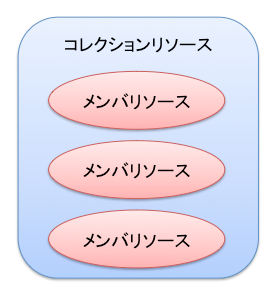
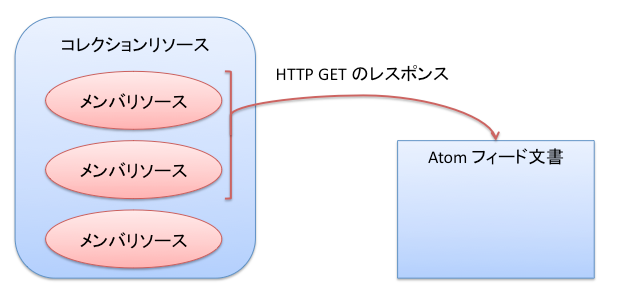
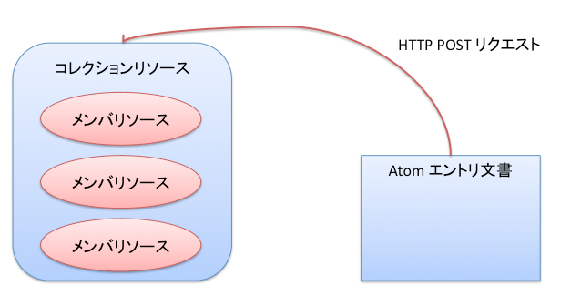
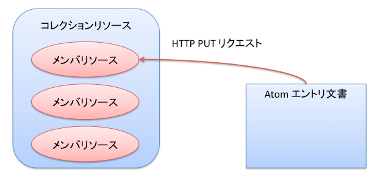
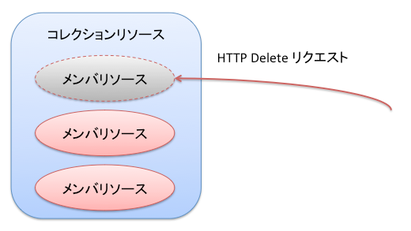

====================
OpenPNE Web API 概要
====================

概要
====

OpenPNE Web API はクライアントがサーバと RFC 4287 (http://tools.ietf.org/rfc/rfc4287.txt) で定められた 2 種類の Atom 文書（Atom フィード文書、 Atom エントリ文書）をやり取りしていくことにより、リソースの取得、作成、更新、削除を実現します。

OpenPNE Web API で扱えるリソースにはメンバリソースとコレクションリソースが存在します。メンバリソースは個々の操作の対象を表すもので、 Atom エントリ文書によって表現されます。コレクションリソースは複数の操作の対象の集合を表すもので、 Atom フィード文書によって表現されます。

メンバリソースとコレクションリソースはそれぞれ対応する URI を持っています。メンバリソースに対応した URI はメンバ URI、コレクションリソースに対応した URI はコレクション URI と呼ばれます。これらの URI に対して適切なリクエストパラメータとリクエストメソッドを用いてアクセスすることにより、リソースに関する操作をおこなうことができます。

たとえばコレクション URI に対して GET することで、コレクションリソースを取得できます。そこから特定のメンバリソースのメンバ URI を知り、メンバ URI に対して GET をすることで、メンバリソースを表す Atom エントリ文書を取得できます。取得できた Atom エントリ文書を修正し、修正した文書を取得元のメンバ URI に対して PUT することでメンバリソースを更新できます。取得した Atom エントリ文書を参考にして新しい 文書を作成し、それをコレクション URI に対して POST することで、新しいメンバリソースをコレクションリソースに追加できます。不要になったリソースはメンバ URI に対して DELETE することで削除できます。

OpenPNE Web API で利用可能な機能
================================

各 API では、以下のいずれかもしくはすべての機能が提供されています。

 * エントリの一覧の取得
     * 全文検索
     * カテゴリによる絞り込み検索
     * 著者や投稿日時などの条件による絞り込み検索
     * 取得開始エントリ、取得件数の制限
     * 取得結果のソート
 * エントリの取得
 * エントリの追加
 * エントリの更新
 * エントリの削除

OpenPNE Web API を使用するための URI
====================================

OpenPNE Web API は、 OpenPNE3 における api アプリケーションからアクセスできます。

api アプリケーションにアクセスするための api.php というフロントコントローラ用スクリプトが存在する場合 (OpenPNE3 のデフォルトの状態)、 URI は以下のような形式になります。

通常のコレクション URI:
  http://example.com/api.php/feeds/{リソースの種類}

親となるリソースが存在する場合のコレクション URI:
  http://example.com/api.php/feeds/{リソースの種類}/{親となるリソースの種類}/{親となるリソースの識別子}

メンバ URI:
  http://example.com/api.php/feeds/{リソースの種類}/{リソースの識別子}

また、ここでは、例示用の以下の URI を使って具体的な API の使用方法について解説をおこないます。

コレクション URI
    http://example.com/api.php/feeds/example

メンバ URI
    http://example.com/api.php/feeds/example/1

クライアントから送信する Atom エントリ文書について
==================================================

そのリソースがどういう Atom エントリ文書によって表現されるかについては、各 API のトップページに解説があります。

(省略可) と記されている要素は、この要素を含めなくても POST や PUT をおこなうことができることを意味しています。また、これらの要素は編集不可でもあり、リクエストされた Atom 文書中にこれらの要素が含まれていたとしても、単に無視されます。

エントリの一覧の取得
====================

エントリの一覧はコレクション URI に対して GET することで取得することができます。

また、適切なリクエストパラメータを付加してアクセスすることで、結果の絞り込みやソートをおこなうことができます。

.. _search-query:

全文検索
--------

全文検索は、 q クエリを用いることでおこなうことができます。

::

  GET /api.php/feeds/example?q=term HTTP/1.1
  Host: example.com

検索において英字の大文字と小文字は区別されません。

::

  GET /api.php/feeds/example?q=term1%20term2 HTTP/1.1
  Host: example.com

%20 は半角スペース文字 ( ) を URL-encode したものです。このリクエストでは、"term1" と "term2" という語を全て含む (AND 検索) エントリを全て取得できます。

::

  GET /api.php/feeds/example?q=%22exact%20phrase%22 HTTP/1.1
  Host: example.com

%22 は半角二重引用符 (")を URL-encode したものです。このリクエストでは、"exact phrase" というフレーズを含むエントリを全て取得できます。

::

  GET /api.php/feeds/example?q=-term HTTP/1.1
  Host: example.com

このリクエストでは、"term" という語を含まないエントリを全て取得できます。

これらのクエリは複合できます。

::

  GET /api.php/feeds/example?q=%22exact%20term%22%20term1%20-term2%20term3 HTTP/1.1
  Host: example.com

このリクエストでは、"exact term" というフレーズを含み、"term1" と "term3" という語を含み、"term2" という語を含まないエントリを全て取得できます。

.. _category-query:

カテゴリ（タグ）による絞り込み検索
----------------------------------

/-/value 表記
+++++++++++++

/-/value 形式 (value は任意の文字列) のクエリを指定することで、カテゴリによる検索をおこなうことができます。

::

  GET /api.php/feeds/example/-/baseball HTTP/1.1
  Host: example.com

このリクエストでは、"baseball" という語に完全一致するカテゴリを持つエントリを全て取得できます。

::

  GET /api.php/feeds/example/-/baseball/japan HTTP/1.1
  Host: example.com

このリクエストでは、"baseball" と "japan" という語に完全一致するカテゴリを全て持つ (AND 検索) エントリを全て取得できます。

::

  GET /api.php/feeds/example/-/baseball%7Csoccer HTTP/1.1
  Host: example.com

%7C は半角パイプ文字 (|) を URL-encode したものです。このリクエストでは、"baseball" と "soccer" という語に完全一致するカテゴリを少なくとも1つ持つ (OR 検索) エントリを全て取得できます。

::

  GET /api.php/feeds/example/-/-baseball HTTP/1.1
  Host: example.com

このリクエストでは、"baseball" という語に完全一致するカテゴリを持たないエントリを全て取得できます。

この表記による category クエリを用いる場合は、他のクエリをカテゴリ記述の後に付加します。

::

  GET /api.php/feeds/example/-/baseball/-soccer?q=term HTTP/1.1
  Host: example.com

このリクエストでは、"baseball" というカテゴリを持ち、"soccer" というカテゴリを持たず、コンテンツに "term" という語を含むエントリを全て取得できます。

.. _category-request-parameter:

category=value 表記
+++++++++++++++++++

category クエリでもカテゴリによる検索をおこなうことができます。

::

  GET /api.php/feeds/example?category=baseball HTTP/1.1
  Host: example.com

このリクエストでは、"baseball" という語に完全一致するカテゴリを持つエントリを全て取得できます。

::

  GET /api.php/feeds/example?category=baseball%2Cjapan HTTP/1.1
  Host: example.com

%2C は半角カンマ文字 (,) を URL-encode したものです。このリクエストでは、"baseball" と "japan" という語に完全一致するカテゴリを全て持つ (AND 検索) エントリを全て取得できます。

::

  GET /api.php/feeds/example?category=baseball%7Csoccer HTTP/1.1
  Host: example.com

このリクエストでは、"baseball" と "soccer" という語に完全一致するカテゴリを少なくとも1つ持つ (OR 検索) エントリを全て取得できます。

この表記では、カテゴリを除外する指定はできません。

著者や投稿日時などの条件による絞り込み検索
------------------------------------------

.. _author-query:

author クエリ
+++++++++++++

このリクエストでは、エントリ著者の URI が "http://example.com/member/1" であるエントリを全て取得できます。

::

  GET /api.php/feeds/example?author=http://example.com/member/1 HTTP/1.1
  Host: example.com

author クエリの値は、エントリ著者の URI に対して完全一致検索をします。

.. _updated-query:

updated-min / updated-max クエリ
++++++++++++++++++++++++++++++++

updated-min および updated-max クエリはエントリ更新日時の範囲を指定した検索をします。

::

  GET /api.php/feeds/example?updated-min=2009-02-01T06:00:00+09:00 HTTP/1.1
  Host: example.com

このリクエストでは、エントリ更新日時が 2009-02-01T06:00:00+09:00 以降のエントリを全て取得できます。

::

  GET /api.php/feeds/example?updated-max=2009-01-31T21:00:00+09:00 HTTP/1.1
  Host: example.com

このリクエストでは、エントリ更新日時が 2009-01-31T21:00:00+09:00 よりも前のエントリを全て取得できます。

このパラメータ値は RFC 3339 タイムスタンプ形式に限ります。下限はその値を含み、上限はその値を含みません。

.. _published-query:

published-min / published-max クエリ
++++++++++++++++++++++++++++++++++++

published-min および published-max クエリはエントリ発行日時の範囲を指定した検索をします。

::

  GET /api.php/feeds/example?published-min=2009-02-01T06:00:00+09:00 HTTP/1.1
  Host: example.com

このリクエストでは、エントリ発行日時が 2009-02-01T06:00:00+09:00 以降のエントリを全て取得できます。

::

  GET /api.php/feeds/example?published-max=2009-01-31T21:00:00+09:00 HTTP/1.1
  Host: example.com

このリクエストでは、エントリ発行日時が 2009-01-31T21:00:00+09:00 よりも前のエントリを全て取得できます。

このパラメータ値は RFC 3339 タイムスタンプ形式に限ります。下限はその値を含み、上限はその値を含みません。

取得開始エントリ、取得件数の制限
--------------------------------

.. _start-query:

start クエリ
++++++++++++

start クエリは取得を開始するエントリの番号を指定します。番号は 1 からはじまります。

デフォルト値 1 が指定されています。

::

  GET /api.php/feeds/example?page=10 HTTP/1.1
  Host: example.com

このリクエストでは、 10 件目にヒットしたエントリから取得を開始します。

.. _max-requests-query:

max-results クエリ
++++++++++++++++++

max-results クエリは取得するエントリの最大数を指定します。

この値はフィードサイズが大きくなりすぎないように、デフォルト値 25 が設定されています。

::

    GET /api.php/feeds/example?max-results=10 HTTP/1.1
    Host: example.com

このリクエストでは、(取得できるエントリ数が10件より多い場合) 1ページで取得するエントリ数を10件に制限できます。

::

    GET /api.php/feeds/example?max-results=500 HTTP/1.1
    Host: example.com

このリクエストでは、(取得できるエントリ数が500件以下の場合) 1ページで全件のエントリ (フィード全体) を取得できます。

取得結果のソート
----------------

.. _orderby-query:

orderby クエリ
++++++++++++++

orderby クエリは取得するリソースのソート順を決める要素を指定します。

orderby パラメータ値は次のものが指定できます。

* published : エントリの発行日時
* updated : エントリの更新日時

この値はデフォルト値 published が設定されています。

::

  GET /api.php/feeds/example?orderby=updated HTTP/1.1
  Host: example.com

このリクエストでは、更新日時が新しい順にエントリを取得できます。

.. _sortorder-query:

sortorder クエリ
++++++++++++++++

sortorder クエリは取得するリソースのソート順を指定します。

sortorder パラメータ値は次のものが指定できます。

* descend : 降順
* ascend : 昇順

この値はデフォルト値 descend が設定されています。

::

  GET /api.php/feeds/example?sortorder=ascend HTTP/1.1
  Host: example.com

このリクエストでは、発行日時が古い順にエントリを取得できます。

エントリの取得
==============

.. image:: image/get_entry.png

メンバ URI に対して GET することで、エントリを取得できます。

::

  GET /api.php/feeds/example/1 HTTP/1.1
  Host: example.com

レスポンスは以下のようになります。

::

  HTTP/1.1 200 Ok
  Date: Sun, 01 Feb 2009 10:25:16 GMT
  Content-Type: application/atom+xml; charset=utf-8
  
  <?xml version="1.0" encoding="UTF-8" ?>
  <entry xmlns="http://www.w3.org/2005/Atom">
    <id>http://example.com/example/1</id>
    <published>2009-01-31T08:23:41+09:00</published>
    <updated>2009-01-31T08:23:41+09:00</updated>
    <title type="text">おはようございます</title>
    <content type="text">今日はとても悪い天気です。</content>
    <author>
      <name>OpenPNE君</name>
      <uri>http://example.com/member/1</uri>
    </author>
    <link rel="self" type="application/atom+xml" href="http://example.com/api.php/feeds/example/1"/>
    <link rel="edit" type="application/atom+xml" href="http://example.com/api.php/feeds/example/1/1"/>
    <link rel="alternate" type="text/html" href="http://example.com/example/1"/>
    <link rel="alternate" href="http://example.com/mobile_frontend.php/example/1"/>
  </entry>

エントリの追加
==============

コレクション URI に対して POST することで、エントリを追加できます。

リクエストの例を以下に示します。

::

  POST /api.php/feeds/example HTTP/1.1
  Host: example.com
  Content-Type: application/atom+xml; charset=utf-8
  
  <?xml version="1.0" encoding="UTF-8" ?>
  <entry xmlns="http://www.w3.org/2005/Atom">
    <title type="text">おはようございます</title>
    <content type="text">今日の天気は曇りです。</content>
    <author>
      <name>OpenPNE君</name>
      <uri>http://example.com/member/1</uri>
    </author>
  </entry>

レスポンスは以下のようになります。

::

  HTTP/1.1 201 Created
  Date: Mon, 02 Feb 2009 00:13:50 GMT
  Location: http://example.com/api.php/feeds/example/3
  Content-Length: 695
  Content-Type: application/atom+xml; charset=utf-8
  
  <?xml version="1.0" encoding="UTF-8" ?>
  <entry xmlns="http://www.w3.org/2005/Atom">
    <id>http://example.com/example/3</id>
    <published>2009-02-02T09:13:51+09:00</published>
    <updated>2009-02-02T09:13:51+09:00</updated>
    <title type="text">おはようございます</title>
    <content type="text">今日の天気は曇りです。</content>
    <author>
      <name>OpenPNE君</name>
      <uri>http://example.com/member/1</uri>
    </author>
    <link rel="edit" type="application/atom+xml" href="http://example.com/api.php/feeds/example/3/1"/>
    <link rel="alternate" type="text/html" href="http://example.com/example/3"/>
    <link rel="alternate" href="http://example.com/mobile_frontend.php/example/3"/>
  </entry>

エントリの更新
==============

メンバ URI に対して PUT することで、エントリを更新できます。

リクエストの例を以下に示します。

::

  PUT /api.php/feeds/example/3/1 HTTP/1.1
  Host: example.com
  Content-Type: application/atom+xml; charset=utf-8
  
  <?xml version="1.0" encoding="UTF-8" ?>
  <entry xmlns="http://www.w3.org/2005/Atom">
    <id>http://example.com/example/3</id>
    <title type="text">おはようございます</title>
    <content type="text">
  今日の天気は曇りです。
  
  追記：
  午後に、土砂降りの雨が降りました。
    </content>
    <author>
      <name>OpenPNE君</name>
      <uri>http://example.com/member/1</uri>
    </author>
  </entry>

レスポンスは以下のようになります。

::

  HTTP/1.1 200 Ok
  Date: Mon, 02 Feb 2009 10:40:20 GMT
  Content-Length: 782
  Content-Type: application/atom+xml; charset=utf-8
  
  <?xml version="1.0" encoding="UTF-8" ?>
  <entry xmlns="http://www.w3.org/2005/Atom">
    <id>http://example.com/example/3</id>
    <published>2009-02-02T09:13:51+09:00</published>
    <updated>2009-02-02T19:40:21+09:00</updated>
    <title type="text">おはようございます</title>
    <content type="text">
  今日の天気は曇りです。
  
  追記：
  午後に、土砂降りの雨が降りました。
    </content>
    <author>
      <name>OpenPNE君</name>
      <uri>http://example.com/member/1</uri>
    </author>
    <link rel="edit" type="application/atom+xml" href="http://example.com/api.php/feeds/example/3/1"/>
    <link rel="alternate" type="text/html" href="http://example.com/example/3"/>
    <link rel="alternate" href="http://example.com/mobile_frontend.php/example/3"/>
  </entry>

エントリの削除
==============

メンバ URI に対して DELETE することで、エントリを削除できます。

リクエストの例を以下に示します。

::

  DELETE /api.php/feeds/example/2 HTTP/1.1
  Host: example.com

レスポンスは以下のようになります。

::

  HTTP/1.1 200 Ok
  Date: Mon, 02 Feb 2009 20:05:18 GMT
