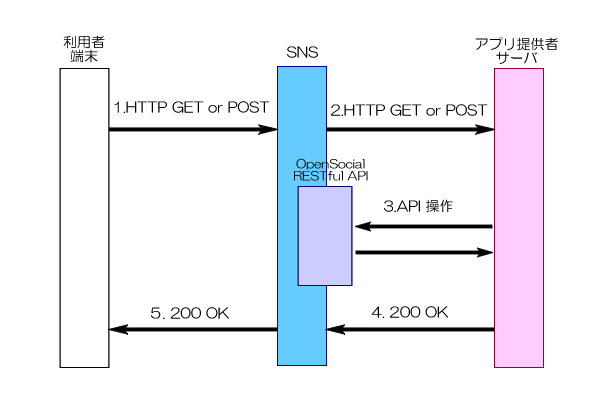

==============
モバイルアプリ
==============

概要
====

1. 利用者の携帯端末からSNSへHTTPリクエストが送られます。

2. SNSからアプリ提供者のサーバへHTTPリクエストが送られます。このとき、パラメタとしてメンバーID、HTTPヘッダとして **署名** と個体識別番号などを除いた端末情報が含まれます。このリクエストを受け取ったサーバでは :ref:`署名<signature>` を検証する必要があります。

3. 必要な場合 :ref:`OpenSocial RESTful API<restful_api>` を利用してソーシャル情報（メンバーの情報やフレンドなど) の取得を試みます。

4. アプリ提供者のサーバ利用者の携帯端末上に表示するHTMLをレスポンスすると、SNSはその内容を出力します。

宣言
====

モバイル版を利用する場合は、Gadget XMLに以下のようなmobile Viewを追加します。

Gadget XML::

  <?xml version="1.0" encoding="UTF-8"?>
  <Module>
    <ModulePrefs title="Test Mobile Application" />
    <Content type="url" view="mobile" href="#START_URL#" />
  </Module>

*#START_URL#* はアプリを開いたときに、最初にリクエストをするURLを指定して下さい。

アプリはPCと同じように追加することができます。

SNSからアプリ提供者へ渡る情報
=============================

リクエストパラメタには以下が追加されます。

opensocial_app_id
  実行中のアプリケーションのID

opensocial_owner_id
  現在アクセスしているメンバーのID

リクエストヘッダには以下が追加されます。

Authorization
  :ref:`署名<signature>` とそれを検証するための情報

User-Agent
  個体識別番号を除いた利用者のUser-Agent

X-Up-*
  X-Up-Subnoを除いた利用者の端末情報

X-Jphone-*
  X-Jphone-Uidを除いた利用者の端末情報

X-S-Display-Info
  ブラウザの表示に関する情報

画面遷移
========

画面遷移はアプリ提供者サーバ上のURLをパラメータに指定したリンクにより行うことができます。
SNSでのセッションを維持するために以下のようにして下さい。

例::

  <a href="?url=#URL#">画面遷移リンク</a>

*#URL#* はアプリ提供者サーバ上のURLをURLエンコードしたものです。

遷移すると指定したURLにリクエストを送ります。

FORMでも同様のURL指定を行って下さい。

招待ページ
==========

アプリを招待するページにリンクする場合は以下のように行って下さい。
出力時に適切なURLに置き換えられます。

例::

  <a href="invite:friends">招待する</a>

オプションとして、callbackパラメータを指定することができます。
これは招待完了時に遷移するURLになります。これを省略した場合は、スタートURLに遷移します。
